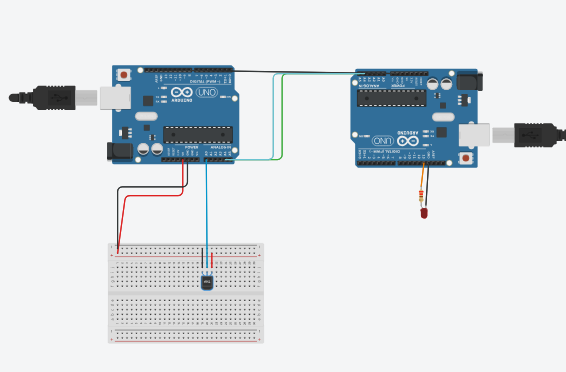
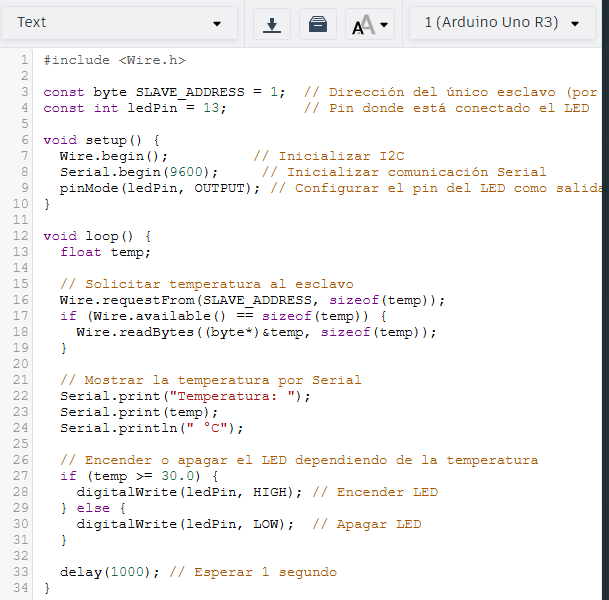
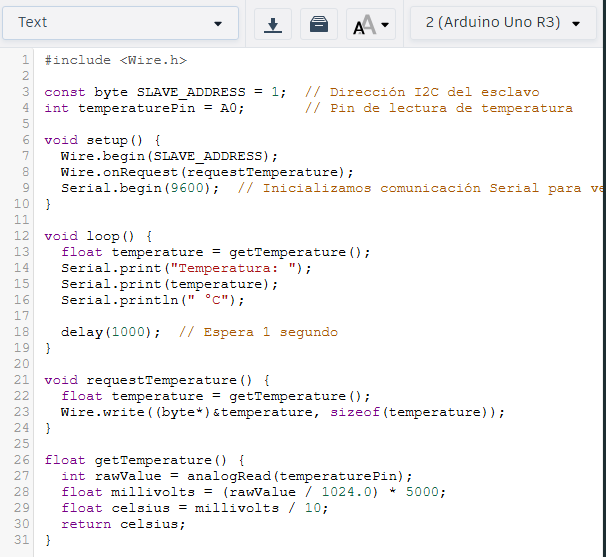

# WorkShop-5

## Diseño del controlador e imlmentación

Para el diseño de este prototipo se utilizaron principalmente 2 programas, los cuales fueron Tinkercad y Wokwi.

En Tinkercad, se implemento un primer acercamiento que consistia de 2 arduinos uno, donde hay un arduino master y un esclado, este ultimo es el que recibe los datos de la temperatura que son enviados por el TMP36 cada segundo, despues de eso, y mediante conexión serial se le envian los datos al arduino esclado, donde se verifica la temperatura, y en caso de ser mas de 30 grados, se debera activar un led. Esta es la implementación que se planteo:



Tambien, a continucacion se documenta el codigo que es usado en ambos Arduinos

Arduino Maestro:



Arduino Esclavo:



De forma siguiente, se implemento el mismo circuito en el programa Wokwi, en donde si se puede utilizar un ESP32, esto es importante ya que al requerir guardar los datos en una representacion de tabla en ThingSpeak es necesario tener un modulo wifi, para poder conectarse mediante IOT a el programa ya mencionado. Dentro de este programa se tienen diferencias en el codigo, ya que el ESP32 necesita cambios en las importaciones, como se mostrara adelante, ademas de eso, se realizo una configuración con los modulos de wifi.h y thingspeak.h, esto para realizar la accion ya mencionada, de poner conectarse y enviar los datos a ThingSpeak. a continuacion se presenta el codigo actualizado del ESP32:

```
#include <Wire.h>
#include <WiFi.h>
#include "ThingSpeak.h"

const char* ssid = "IPhone de Gabbo";         // 🔵 Tu red WiFi
const char* password = "Saltarin.123";  // 🔵 Tu contraseña WiFi

unsigned long channelID = 2943302;  // 🔵 Tu Channel ID
const char* writeAPIKey = "39SYLBJLOTYOW7MU";    // 🔵 Tu API Key

WiFiClient client;

const byte SLAVE_ADDRESS = 1; // Dirección I2C del esclavo
float temperature;

const int ledPin = 18; // Pin donde está conectado el LED

void setup() {
  Serial.begin(115200);
  Wire.begin(21, 22);   // SDA = 21, SCL = 22 en ESP32
  pinMode(ledPin, OUTPUT);

  WiFi.begin(ssid, password);
  Serial.print("Connecting to WiFi...");
  while (WiFi.status() != WL_CONNECTED) {
    delay(500);
    Serial.print(".");
  }
  Serial.println("\nConnected to WiFi.");

  ThingSpeak.begin(client);
}

void loop() {
  // Pedir temperatura al esclavo
  Wire.requestFrom(SLAVE_ADDRESS, sizeof(temperature));
  if (Wire.available() == sizeof(temperature)) {
    Wire.readBytes((byte*)&temperature, sizeof(temperature));
  }

  Serial.print("Temperatura: ");
  Serial.println(temperature);

  // Controlar LED
  if (temperature >= 30.0) {
    digitalWrite(ledPin, HIGH);
  } else {
    digitalWrite(ledPin, LOW);
  }

  // Publicar en ThingSpeak
  ThingSpeak.setField(1, temperature); // Temperatura
  ThingSpeak.setField(2, (temperature >= 30.0) ? 1 : 0); // Alerta

  int x = ThingSpeak.writeFields(channelID, writeAPIKey);


  if (x == 200) {
    Serial.println("Datos enviados a ThingSpeak exitosamente.");
  } else {
    Serial.print("Error enviando datos. Código HTTP: ");
    Serial.println(x);
  }

  delay(20000); // Esperar mínimo 15 segundos (recomendado 20s)
}
```

Se puede ver que este codigo tiene diferencias en el tema de utilizar las conexiones Wifi para poder tener contacto con la tabla que montamos en ThingSoeak, ademas de eso, se hace el mismo control que el arduino maestro del punto anterior.

##IoT Deployment

PAra el desarrollo de la parte de Iot del proyecto, primeramente se creo una cuenta en la pagina ThiingSpeak, donde se permite realizar monitoreos de tipos de conexiones, para esto se tiene que crear un nuevo canal, como lo llaman ellos, este canal tiene unos datos importantes que se pudieron ver en el codigo presentado arriba, los cuales son:

```
unsigned long* channelID = "2943302"; 
const char* writeAPIKey = "39SYLBJLOTYOW7MU";

```

Esto es la forma que se tiene para conectarse al canal, el cual monitera las variables de la temperatura, demostrada en una tabla con relacion al tiempo y un "led" donde al momento de sobre pasar la temperatura se enciende, igual que el led fisico que se tiene. Ademas de esto, en el codigo se tuvo que utilizar la libreria de Wifi, ya que es la que permite utilizar el modulo de conexion y poder conectarse, para esto, ambos dispositivos, tanto el ESP 32 y el computador donde se esta corriendo el monitoreo en ThingSpeak tienen que estar en la misma red Wifi, que para este proyecto en especifico, fue un Hostpot de uno de los celulared del grupo.

## Explicación del codigo

En primer lugar, se incluyen tres librerías clave: Wire.h permite la comunicación I2C entre el ESP32 y otro microcontrolador (por ejemplo, un Arduino), WiFi.h se utiliza para conectar el ESP32 a una red Wi-Fi, y ThingSpeak.h proporciona funciones para enviar datos a la plataforma de IoT ThingSpeak. Luego, se definen las credenciales Wi-Fi y la información del canal de ThingSpeak (ID del canal y clave de escritura). También se declara la dirección I2C del dispositivo esclavo, una variable para almacenar la temperatura y el pin al que está conectado el LED de advertencia.

En la función setup(), se inicializa la comunicación serial para monitorear la salida en el monitor serial. Luego, se configura la comunicación I2C del ESP32 usando Wire.begin(), especificando los pines SDA (GPIO 21) y SCL (GPIO 22). El pin del LED se establece como salida. A continuación, se establece la conexión Wi-Fi mediante WiFi.begin(). El ESP32 espera en un bucle hasta que se conecte exitosamente a la red. Una vez conectado, se inicializa la comunicación con ThingSpeak usando ThingSpeak.begin(), pasando como argumento el cliente Wi-Fi.

La función loop() se ejecuta continuamente. Primero, el ESP32 solicita datos al esclavo mediante Wire.requestFrom(), solicitando el número de bytes equivalente a una variable tipo float. Luego, si los datos están disponibles, se leen y se almacenan en la variable temperature con Wire.readBytes(). Esta temperatura se imprime en el monitor serial para observación local.

Después, el código evalúa si la temperatura supera los 30 °C. Si es así, enciende el LED conectado al pin 18 mediante digitalWrite(HIGH); de lo contrario, lo apaga con digitalWrite(LOW).

Finalmente, se preparan los datos para enviarlos a ThingSpeak. ThingSpeak.setField() se usa para asignar el valor de temperatura al campo 1 y un valor binario (1 o 0) al campo 2 como señal de alerta si se ha superado el umbral. La función ThingSpeak.writeFields() se encarga de enviar los datos al canal correspondiente. Si la operación fue exitosa (código HTTP 200), se notifica por el monitor serial; si no, se informa el código de error. El delay(20000) al final de loop() asegura que los datos se envíen cada 20 segundos, cumpliendo con las restricciones de tiempo de ThingSpeak para cuentas gratuitas.
